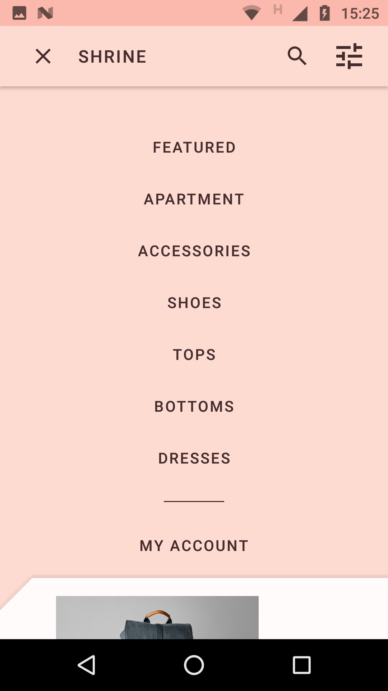
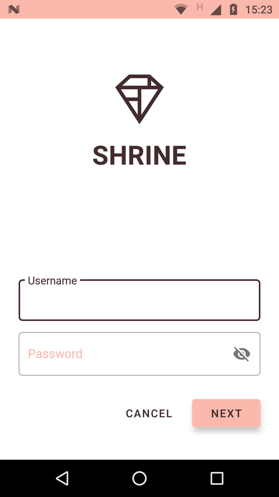
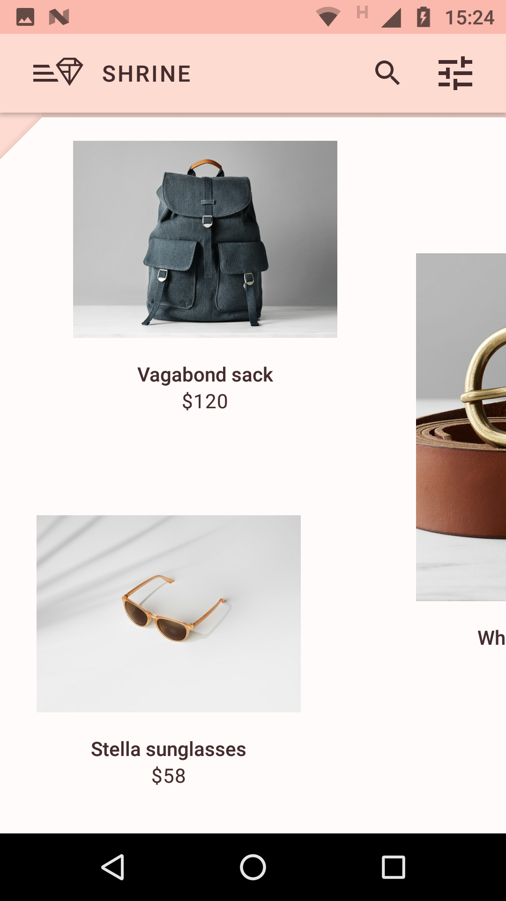
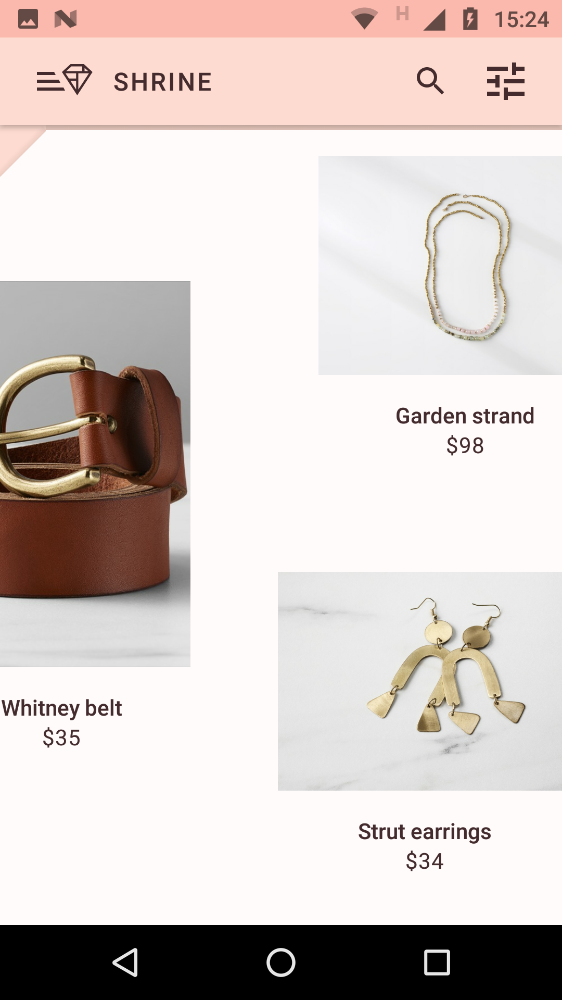

# Codelab Material Design Components para Android con Kotlin

   

Codelab oficial para practicar el uso de Material Design Components en Android con Kotlin, realizando un app llamada Shrine que simula una app de compra y venta de productos como carteras, sombreros, joyas, etc., haciendo uso de elementos como CardViews, AppBarLayout, uso de diferentes Themes y tipografías, la utilización de un BackDrop para agregar un menu y un sutil movimiento para darle otro efecto a la aparición del menu.
